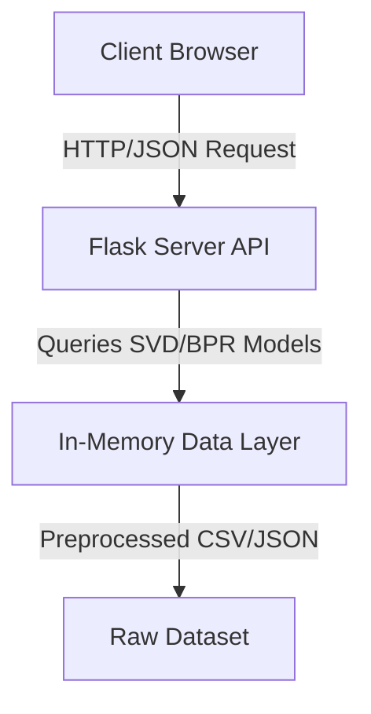
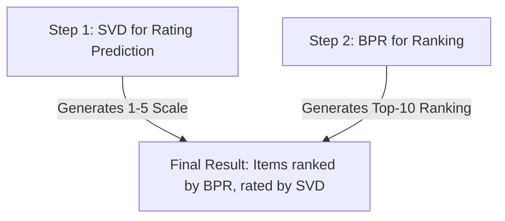

# BPR-SVD-Music-Recommender

<p align="center">
  
  
  
  
</p>

> An AI-powered recommender system for musical instruments using BPR and Bias-Corrected SVD. Built for CS 550 (Recommender Systems).

---

## Table of Contents

- [Overview](#overview)
- [Features](#features)
- [Software Architecture](#software-architecture)
- [Algorithms](#algorithms)
- [Project Structure](#project-structure)
- [Requirements](#requirements)
- [Installation](#installation)
- [Usage](#usage)
- [API Reference](#api-reference)
- [Performance Metrics](#performance-metrics)
- [Dataset](#dataset)
- [Technical Deep Dive](#technical-deep-dive)
- [Future Enhancements](#future-enhancements)
- [Team](#team)
- [License](#license)

---

## Overview

This project implements a hybrid recommender system combining:

1. **Bias-Corrected SVD** for rating prediction
2. **Bayesian Personalized Ranking (BPR)** for top-K recommendations

The web demo allows users to enter an Amazon Customer ID and receive personalized product recommendations with predicted ratings, product details, descriptions, and performance analytics.

---

## Features

### Core Features
- **Personalized Recommendations** - Top-10 product recommendations per user
- **Rating Prediction** - Predicted star rating (1-5) for each recommendation
- **User Analytics** - Profile metrics including precision, recall, NDCG
- **Rating Distribution** - Visual chart of user's rating habits
- **Product Details** - Brand, category, price, and description for each product
- **Expandable Cards** - Click on any recommendation to view full product description

### Technical Features
- **REST API** - Clean Flask backend with JSON responses
- **CORS Enabled** - Cross-origin requests supported
- **In-Memory Caching** - All data loaded at startup for fast queries
- **Responsive Design** - Works on desktop and mobile
- **Dark Theme** - Linear.app-inspired UI with purple/cyan accents
- **Smart Filtering** - Automatically filters to users with valid product metadata

### Algorithm Features
- **Bias Correction** - Accounts for user and item rating tendencies
- **Latent Factors** - 50-dimensional user/item embeddings
- **Ranking Optimization** - BPR specifically designed for ranking tasks
- **Cold Start Handling** - Graceful fallback for unknown users/items

---

## Software Architecture



### Data Flow


---

## Algorithms

### 1. Bias-Corrected SVD (Rating Prediction)

#### The Problem
Given sparse user-item ratings, predict the rating a user would give to an item they haven't rated.

#### The Solution: Matrix Factorization with Biases

The predicted rating is decomposed as:

```
r̂_ui = μ + b_u + b_i + p_u · q_i
```

Where:
| Symbol | Meaning |
|--------|---------|
| `μ` | Global mean rating (baseline) |
| `b_u` | User bias (harsh vs generous rater) |
| `b_i` | Item bias (good vs bad product) |
| `p_u` | User latent factor vector (50-dim) |
| `q_i` | Item latent factor vector (50-dim) |
| `p_u · q_i` | Dot product capturing latent interactions |

### 2. Bayesian Personalized Ranking (BPR)

#### The Problem
Predict the optimal ranking of items for a user (not just the rating).

#### Why BPR Over SVD for Recommendations?

SVD optimizes for **rating prediction accuracy**, not **ranking quality**. BPR is specifically designed for ranking.

#### The BPR Loss Function

BPR learns from implicit feedback (what users interacted with):

```
argmax ∏ σ(x_ui - x_uj) · exp(-λ(‖p_u‖² + ‖q_i‖² + ‖q_j‖²))
```

### 3. Hybrid Approach

This project combines both:



---

## Project Structure

```
MDM/
├── recommender_demo/              # Web Demo Application
│   ├── app.py                    # Flask REST API
│   ├── templates/
│   │   └── index.html            # Single-page frontend
│   └── __pycache__/             # Python cache
│
├── data/                         # Preprocessed Data
│   ├── train.csv                 # Training set
│   ├── test.csv                  # Test set
│   ├── user2idx.pkl              # User ID → Index mapping
│   ├── item2idx.pkl              # Item ID → Index mapping
│   ├── user_bias.pkl             # User bias values
│   ├── item_bias.pkl             # Item bias values
│   ├── R_pred.npy                # SVD prediction matrix
│   ├── R_pred_biased.npy         # Bias-corrected SVD matrix
│   ├── rating_predictions_improved.csv  # SVD predictions per user-item
│   ├── bpr_recommendations_improved.csv # BPR recommendations per user
│   └── meta_Musical_Instruments.json.gz  # Product metadata
│
├── step1_preprocessing.py        # Data loading & train/test split
├── step2_improved.py             # Bias-Corrected SVD implementation
├── step3_improved.py             # BPR implementation (using Cornac)
│
├── Musical_Instruments_5.json     # Raw Amazon dataset
├── requirements.txt               # Python dependencies
└── README.md                     # This file
```

---

## Requirements

### Software Requirements

| Requirement | Version | Purpose |
|-------------|---------|---------|
| Python | 3.8+ | Runtime |
| pip | Latest | Package manager |

### Python Packages

| Package | Version | Purpose |
|---------|---------|---------|
| Flask | 3.0+ | Web framework |
| flask-cors | 4.0+ | Cross-origin requests |
| pandas | 2.0+ | Data manipulation |
| numpy | 1.24+ | Numerical computing |
| scipy | 1.10+ | Sparse SVD |
| cornac | 2.0+ | BPR implementation |
| tqdm | 4.0+ | Progress bars |

---

## Installation

### Step 1: Clone or Download

```bash
git clone <repository-url>
cd MDM
```

### Step 2: Create Virtual Environment (Recommended)

```bash
python -m venv venv
venv\Scripts\activate  # Windows
source venv/bin/activate  # macOS/Linux
```

### Step 3: Install Dependencies

```bash
pip install flask flask-cors pandas numpy scipy cornac tqdm
```

Or:

```bash
pip install -r requirements.txt
```

### Step 4: Verify Data Files

```bash
dir data\*.csv
```

---

## Usage

### Running the Pipeline (Optional)

If you want to regenerate the models:

```bash
python step1_preprocessing.py
python step2_improved.py
python step3_improved.py
```

### Running the Web Demo

```bash
cd recommender_demo
python app.py
```

Output:

```
==================================================
RecSys Demo - Recommender System API
==================================================
Server running at: http://localhost:5001
==================================================
```

### Accessing the Demo

Open your browser:

```
http://localhost:5001
```

### Demo Interface Guide

```
┌────────────────────────────────────────────────────────────────[...]
│ [Logo] RecSys Demo    Musical Instruments · BPR + Bias-SVD  MAE │
├────────────────────────────────────────────────────────────────[...]
│                                                                │
│               Discover Your Perfect Instrument                 │
│        AI-powered recommendations using Bayesian               │
│               Personalized Ranking                             │
│                                                                │
│         ┌───────────────────────────────────────┐              │
│         │  Enter Customer ID...             🔍   │              │
│         └───────────────────────────────────────┘              │
│                                                                │
│           Try these:  [A100S1JQ...] [AT1TVEC...]               │
│                        [A1K91RAC...] [A1431CD3...]             │
│                                                                │
├────────────────────────────────────────────────────────────────[...]
│                     RESULTS (after search)                     │
│ ┌────────────────┐  ┌─────────────────────────────────────────┐│
│ │ USER PROFILE   │  │  TOP 10 RECOMMENDATIONS         [LIVE] ││
│ │ ID: A100S1...  │  │                                         ││
│ │ Ratings: 5     │  │  ┌─────────────────────────────────┐    ││
│ │ Avg: 4.8       │  │  │ #1  Product Title         ▼    │    ││
│ │ Since: Oct 2010│  │  │     ★★★★★  5.0                 │    ││
│ │ Metrics:       │  │  │     Brand · Category · Price    │    ││
│ │ Precision: 0.1 │  │  │     Description (expanded)      │    ││
│ │ Recall: 0.5    │  │  └─────────────────────────────────┘    ││
│ │ NDCG: 0.613    │  │  ┌─────────────────────────────────┐    ││
│ │ Rating Dist:   │  │  │ #2  Another Product       ▼    │    ││
│ │ [Chart.js]     │  │  │     ★★★★☆  4.8                 │    ││
│ └────────────────┘  └─────────────────────────────────────────┘│
├────────────────────────────────────────────────────────────────[...]
│  MAE: 0.64    RMSE: 0.99    Precision@10: 0.039    NDCG@10: 0.093│
└────────────────────────────────────────────────────────────────[...]
```

### Sample User IDs

The demo shows sample user chips. Click any to see recommendations for that user.

---

## API Reference

### Endpoints

#### GET /
Serves the web frontend.

```bash
GET http://localhost:5001/
```

#### GET /api/stats
Returns global dataset statistics.

```json
{
  "total_users": 27523,
  "total_items": 10580,
  "total_ratings": 176048,
  "avg_rating": 4.48,
  "sparsity": 99.94,
  "model_mae": 0.6392,
  "model_rmse": 0.9859,
  "precision_all": 0.0032,
  "recall_all": 0.0229,
  "ndcg_all": 0.0152,
  "precision_active": 0.0056,
  "recall_active": 0.0132,
  "ndcg_active": 0.0108
}
```

#### GET /api/sample_users
Returns 6 random user IDs.

```json
{
  "users": ["A100S1JQ5XK960", "AT1TVECV2SV6Z", ...]
}
```

#### GET /api/user/<user_id>
Returns user profile with metrics.

```json
{
  "user_id": "AT1TVECV2SV6Z",
  "total_ratings": 8,
  "avg_rating": 5.0,
  "member_since": "Jun 2016",
  "precision": 0.1,
  "recall": 0.5,
  "f_measure": 0.167,
  "ndcg": 0.613
}
```

#### GET /api/recommendations/<user_id>
Returns top-10 recommendations with product details.

```json
{
  "recommendations": [
    {
      "rank": 1,
      "item_id": "B00V374DOI",
      "product_title": "Product Name",
      "brand": "Brand Name",
      "category": "Guitars",
      "price": "$29.99",
      "description": "Product description text...",
      "has_metadata": true,
      "predicted_rating": 4.9
    }
  ]
}
```

#### GET /api/user/<user_id>/ratings
Returns user's rating distribution.

```json
{
  "user_id": "AT1TVECV2SV6Z",
  "distribution": {
    "1": 0,
    "2": 0,
    "3": 0,
    "4": 2,
    "5": 6
  }
}
```

### Error Responses

**404 - User Not Found:**
```json
{
  "error": "User not found",
  "user_id": "INVALID_USER_ID"
}
```

---

## Performance Metrics

### Rating Prediction (Bias-Corrected SVD)

| Metric | Value | Description |
|--------|-------|-------------|
| **MAE** | 0.6392 | Mean Absolute Error |
| **RMSE** | 0.9859 | Root Mean Square Error |
| **Improvement over baseline** | 14.45% | MAE improvement |

### Top-K Recommendation (BPR)

| Metric | All Users | Active Users (≥3 test items) |
|--------|-----------|-------------------------------|
| **Precision@10** | 0.0032 | 0.0056 |
| **Recall@10** | 0.0229 | 0.0132 |
| **F-measure@10** | 0.0054 | 0.0076 |
| **NDCG@10** | 0.0152 | 0.0108 |

### Understanding the Metrics

| Metric | What it measures | Ideal value |
|--------|-----------------|-------------|
| **MAE** | Average error in predicted ratings | Lower is better |
| **RMSE** | Penalty for large errors | Lower is better |
| **Precision@10** | Fraction of recommended items that are relevant | Higher is better |
| **Recall@10** | Fraction of relevant items that were recommended | Higher is better |
| **NDCG** | Ranking quality (discounted gain) | Higher is better |

---

## Dataset

### Source
Amazon Product Reviews - Musical Instruments (5-core subset)

### Statistics
| Statistic | Value |
|-----------|-------|
| Total reviews | 231,392 |
| After deduplication | 176,048 |
| Unique users | ~27,000 |
| Unique items | ~8,300 |
| Average rating | 4.47 |
| Sparsity | ~99.9% |

### Product Metadata
The demo uses `meta_Musical_Instruments.json.gz` which contains:
- Product titles
- Brand names
- Prices
- Categories
- Descriptions

---

## Future Enhancements

### Short-term (Academic Projects)
- [ ] Add content-based features (item metadata)
- [ ] Implement ALS (Alternating Least Squares) for comparison
- [ ] Add temporal dynamics (time-decay weighting)
- [ ] Implement hybrid SVD++ with implicit feedback

### Medium-term (Portfolio Projects)
- [ ] Deploy to cloud (AWS/GCP/Azure)
- [ ] Add user authentication
- [ ] Implement real-time model updates
- [ ] Add A/B testing framework

### Long-term (Production)
- [ ] Real-time recommendation API
- [ ] Integration with e-commerce platform
- [ ] Multi-modal recommendations (text + images)
- [ ] Deep learning models (NCF, Transformer-based)

---

## Team

- Adish Padalia
- Saumya Desai
- Aryan Dave

---

## License

This project is for educational purposes as part of CS 550 (Recommender Systems).

---

## Acknowledgments

- **Dataset**: [Amazon Product Reviews](https://s3.amazonaws.com/amazon-reviews-pds/readme.html)
- **BPR Library**: [Cornac](https://github.com/PreferredAI/cornac)
- **UI Inspiration**: [Linear.app](https://linear.app)
- **Professor**: CS 550 Course Staff

---

<p align="center">
  Built with ❤️ for CS 550
</p>